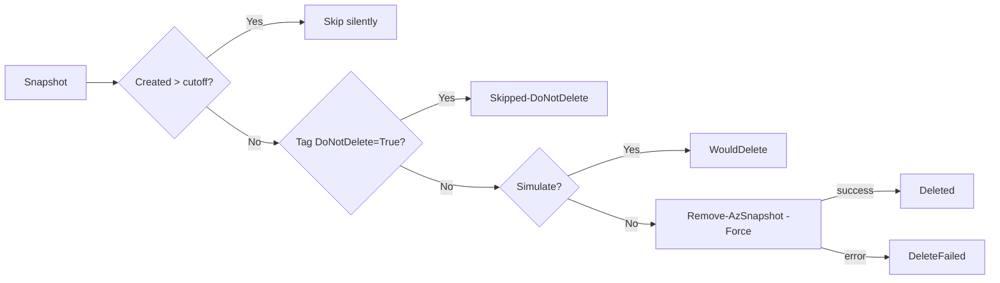

# Azure VM Snapshot Cleanup

> **Automated Azure Managed Disk snapshot lifecycle management.**
> Discovers, reports and deletes stale snapshots across multiple Azure landing zones on a weekly schedule, with a built-in *simulation* run the day before so owners can opt their snapshots out of cleanup by tagging them.


---

## Table of Contents

1. [Overview](#overview)
2. [Repository Structure](#repository-structure)
3. [The Two Pipelines](#the-two-pipelines)
4. [PowerShell Script — `SnapShot-CleanUp.ps1`](#powershell-script--snapshot-cleanupps1)
5. [The `DoNotDelete` Opt-Out Tag](#the-donotdelete-opt-out-tag)
6. [Landing Zones &amp; Subscription Mapping](#landing-zones--subscription-mapping)
7. [Prerequisites](#prerequisites)
8. [How It Runs (Schedule &amp; Manual)](#how-it-runs-schedule--manual)
9. [Report / CSV Schema](#report--csv-schema)
10. [Email Notification](#email-notification)
11. [Customisation](#customisation)
12. [Troubleshooting](#troubleshooting)

---

## Overview

Azure Managed Disk snapshots accumulate over time as part of patching, releases and break-fix activity. They are billable storage and, if left unmanaged, become a sizeable cost and security-hygiene issue.

This solution provides a **safe, auditable, two-step weekly cleanup** for VM snapshots stored in dedicated `rg-snap-<landing-zone>` resource groups:

| Step | When | What it does |
|------|------|--------------|
| **1. Simulate** | Friday 09:00 (configurable) | Lists every snapshot that *would* be deleted next day. Sends a `[SIMULATION]` report email so owners can opt out by tagging. |
| **2. Cleanup**  | Saturday 09:00 (configurable) | Actually deletes snapshots older than the retention threshold, except those tagged `DoNotDelete=True`. Sends the final report. |

Everything is driven from **Azure DevOps Pipelines** executing a single shared **PowerShell** worker script per landing zone.

---

**High-level flow**

1. The pipeline is triggered on a cron schedule (or manually).
2. It iterates over every configured landing zone and authenticates with the matching Azure DevOps service connection.
3. For each landing zone, the same `SnapShot-CleanUp.ps1` script runs and emits a per-LZ CSV report.
4. After all landing zones complete, the pipeline merges the CSVs, publishes them as a build artifact, and emails the consolidated report to the operations distribution list.

---

## Repository Structure

```
azure-snapshot-cleanup/
├── pipeline/
│   ├── SnapShot-Simulate.yml   # Friday — dry-run / preview pipeline
│   └── SnapShot-Cleanup.yml    # Saturday — real cleanup pipeline
├── scripts/
│   └── SnapShot-CleanUp.ps1    # Per-LZ worker (called by both pipelines)
└── README.md
```

---

## The Two Pipelines

Both pipelines share the **same stages, steps and worker script**. They differ only in their schedule and a handful of parameters.

| Aspect | `SnapShot-Simulate.yml` | `SnapShot-Cleanup.yml` |
|--------|-------------------------|-------------------------|
| Cron schedule | `0 8 * * 5` — **Fri 09:00 (UTC+1)** | `0 8 * * 6` — **Sat 09:00 (UTC+1)** |
| Default `simulate` parameter | `true` | `false` |
| `olderThanDays` | `14` | `15` |
| Branch | `main` | `main` |
| `trigger` / `pr` | `none` (schedule-only) | `none` (schedule-only) |
| Email subject | `[SIMULATION] Snapshot Cleanup Report` | `Snapshot Cleanup Report` |
| Outcome | Reports `WouldDelete` rows — no API change | Calls `Remove-AzSnapshot -Force` |

> **Why two thresholds (14 vs 15 days)?**
> The simulation looks one day further back than the cleanup. This guarantees that **everything appearing in Friday’s preview will still be deletable on Saturday** — owners get a full 24-hour window to add the `DoNotDelete=True` tag.

### Pipeline stages (identical in both files)

1. **Checkout** the repo onto the agent.
2. **Create Report Folder** — `$(Build.ArtifactStagingDirectory)/snapshot-reports`.
3. **Loop Through Landing Zones** — emits one `AzurePowerShell@5` task per LZ using the matching service connection (`sc-<lz>`) and writes `<lz>.csv` to the report folder.
4. **Merge CSV Reports** — concatenates all per-LZ CSVs into `SnapshotCleanupReport.csv` and prints a status summary.
5. **Publish Artifact** — publishes the report folder as the `SnapshotReports` artifact.
6. **Send Email Report** — uses `Send-MailMessage` over the configured SMTP relay (default `smtp.example.com:25`) to email the consolidated CSV (with attachment) to the configured recipient (default `ops-team@example.com`).

### Pipeline parameters (overridable when queued manually)

| Parameter | Type | Default (Simulate / Cleanup) | Description |
|-----------|------|------------------------------|-------------|
| `landingZones` | object (list) | `lz-sandbox`, `lz-dev`, `lz-test`, `lz-prod` | Which Azure landing zones to process. |
| `simulate` | boolean | `true` / `false` | If `true`, snapshots are only listed (`WouldDelete`); if `false`, they are deleted. |

### Pipeline variables

| Variable | Value | Purpose |
|----------|-------|---------|
| `olderThanDays` | `14` (Simulate) / `15` (Cleanup) | Snapshot age threshold. |
| `reportFolder` | `$(Build.ArtifactStagingDirectory)/snapshot-reports` | Working directory for CSVs. |
| `smtpServer` | `smtp.example.com` | SMTP relay (replace with your own). |
| `smtpPort` | `25` | SMTP port. |
| `mailFrom` | `no-reply@example.com` | Sender address. |
| `mailTo` | `ops-team@example.com` | Recipient distribution list. |

---

## PowerShell Script — `SnapShot-CleanUp.ps1`

The worker script is invoked **once per landing zone** by both pipelines. It is fully parameterised and produces a per-LZ CSV.

### Parameters

| Parameter | Type | Required | Description |
|-----------|------|----------|-------------|
| `-ResourceGroup` | string | ✅ | Resource group containing the snapshots (`rg-snap-<lz>`). |
| `-LandingZone` | string | ✅ | Landing zone name; used to look up the correct `SubscriptionId`. |
| `-OlderThanDays` | int | ✅ | Snapshots older than this many days are candidates for deletion. |
| `-Simulate` | bool | ❌ (default `$true`) | When `$true`, the script reports but never deletes. |
| `-ReportPath` | string | ✅ | Path for the per-LZ CSV output. |

### What the script does, step by step

1. **Map landing zone → subscription.** A `switch` statement resolves the supplied `-LandingZone` to a hard-coded subscription GUID; unknown values cause a hard `throw`.
2. **Set Az context.** `Set-AzContext -SubscriptionId $SubscriptionId -ErrorAction Stop` ensures every subsequent call hits the right subscription.
3. **Compute cutoff date.** `(Get-Date).ToUniversalTime().Date.AddDays(-$OlderThanDays)` — UTC midnight, removing time-of-day jitter.
4. **List snapshots.** `Get-AzSnapshot -ResourceGroupName $ResourceGroup` (errors are surfaced and re-thrown).
5. **Per snapshot, decide the action:**
   - **Newer than cutoff** → silently skip.
   - **Tag `DoNotDelete=True`** → record `Skipped-DoNotDelete`, continue.
   - **`Simulate=$true`** → record `WouldDelete`, continue.
   - **Otherwise** → `Remove-AzSnapshot -Force`. On success record `Deleted`; on failure record `DeleteFailed` with the exception message.
6. **Export CSV.** Write the in-memory report array to `$ReportPath` via `Export-Csv -NoTypeInformation`.

### Decision flow



---

## The `DoNotDelete` Opt-Out Tag

If a snapshot must be retained beyond the standard retention window (e.g. for an ongoing investigation, a planned migration, or compliance hold), simply tag it:

| Tag | Value |
|-----|-------|
| `DoNotDelete` | `True` |

The script reads tags case-insensitively for the value, so `true`, `True`, `TRUE` all work. The tag **key** must be exactly `DoNotDelete`.

> Snapshots with this tag are recorded in the report with status `Skipped-DoNotDelete` so there is still a clear audit trail.

**How to add the tag (Azure CLI):**

```bash
az snapshot update \
  --resource-group rg-snap-lz-prod \
  --name <snapshot-name> \
  --set tags.DoNotDelete=True
```

**How to add it (PowerShell):**

```powershell
$snap = Get-AzSnapshot -ResourceGroupName rg-snap-lz-prod -SnapshotName <snapshot-name>
$snap.Tags["DoNotDelete"] = "True"
Update-AzSnapshot -ResourceGroupName rg-snap-lz-prod -SnapshotName <snapshot-name> -Snapshot $snap
```

---

## Landing Zones &amp; Subscription Mapping

The mapping is hard-coded inside `SnapShot-CleanUp.ps1`. Replace the
placeholder GUIDs below with your own subscription IDs before running:

| Landing Zone | Subscription ID (placeholder) |
|--------------|-------------------------------|
| `lz-sandbox`     | `00000000-0000-0000-0000-000000000001` |
| `lz-integration` | `00000000-0000-0000-0000-000000000002` |
| `lz-dev`         | `00000000-0000-0000-0000-000000000003` |
| `lz-test`        | `00000000-0000-0000-0000-000000000004` |
| `lz-prod`        | `00000000-0000-0000-0000-000000000005` |

> Add a new landing zone in **two places**: the `landingZones` parameter list in the YAML pipelines, **and** the `switch` block in the PowerShell script.

---

## Prerequisites

| Requirement | Detail |
|-------------|--------|
| **Azure DevOps service connections** | One per landing zone, named `sc-<landing-zone>` (e.g. `sc-lz-prod`). The SPN behind each must have at least `Microsoft.Compute/snapshots/read` and `Microsoft.Compute/snapshots/delete` on the target RG. |
| **Resource group naming** | Snapshots must live in `rg-snap-<landing-zone>` (the convention can be changed in the YAMLs). |
| **Agent pool** | An Azure DevOps agent (Microsoft-hosted or self-hosted) with PowerShell 7+ and the `Az` module installed (`AzurePowerShellVersion: LatestVersion`). |
| **Network egress** | Agent must reach the configured SMTP relay (default `smtp.example.com:25`). |
| **Repository branch** | The schedule fires only against the `main` branch by default — pipelines must be defined on that branch in Azure DevOps, or the branch reference updated. |

### Local development / offline simulation

You can dry-run the worker logic on your laptop without touching Azure
using the bundled mock harness:

```powershell
pwsh ./tests/Mock-Simulate.ps1
```

This stubs out `Set-AzContext`, `Get-AzSnapshot` and `Remove-AzSnapshot`,
feeds the script a synthetic snapshot inventory and verifies that the
`DoNotDelete` opt-out, age threshold, simulation mode, and CSV output
all behave as expected.

---

## How It Runs (Schedule &amp; Manual)

### Scheduled

| Pipeline | Cron (UTC) | Local time |
|----------|------------|------------|
| `SnapShot-Simulate.yml` | `0 8 * * 5` | **Fri 09:00 (UTC+1)** |
| `SnapShot-Cleanup.yml`  | `0 8 * * 6` | **Sat 09:00 (UTC+1)** |

Both have `always: true`, so they run even when there are no new commits on the branch.

### Manual run

From Azure DevOps:

1. Pipelines → choose **SnapShot-Simulate** or **SnapShot-Cleanup** → **Run pipeline**.
2. Select the branch where the YAMLs are stored (default `main`).
3. Optionally override:
   - `landingZones` — to target a single LZ (e.g. only `lz-sandbox`).
   - `simulate` — flip to `true` for a manual dry run on the cleanup pipeline, or `false` to force a real cleanup outside the schedule.

---

## Report / CSV Schema

Each landing zone produces `<landing-zone>.csv`. They are merged into `SnapshotCleanupReport.csv`.

| Column | Description |
|--------|-------------|
| `LandingZone` | The LZ being processed (e.g. `lz-prod`). |
| `Subscription` | Azure subscription GUID resolved from the LZ. |
| `ResourceGroup` | Resource group scanned (`rg-snap-<lz>`). |
| `SnapshotName` | Azure snapshot resource name. |
| `CreatedDate` | Snapshot creation timestamp (UTC). |
| `Status` | One of: `Deleted`, `WouldDelete`, `Skipped-DoNotDelete`, `DeleteFailed`. |
| `Simulation` | `True` for the Friday run, `False` for Saturday (or manual cleanups). |
| `ErrorMessage` | Populated only on `DeleteFailed`. |

### Possible status values

| Status | Meaning |
|--------|---------|
| `WouldDelete` | Simulation mode found this snapshot eligible for deletion. |
| `Skipped-DoNotDelete` | Skipped because of the `DoNotDelete=True` tag. |
| `Deleted` | Successfully removed by `Remove-AzSnapshot`. |
| `DeleteFailed` | Deletion attempt threw — see `ErrorMessage` column. |

> Snapshots that are *newer than the cutoff* are not written to the CSV at all — the report focuses on actionable items.

---

## Email Notification

After the merge, the pipeline sends one consolidated email:

- **From:** configured `mailFrom` (default `no-reply@example.com`)
- **To:** configured `mailTo` (default `ops-team@example.com`)
- **Subject (Simulate):** `[SIMULATION] Snapshot Cleanup Report`
- **Subject (Cleanup):** `Snapshot Cleanup Report`
- **Body:** brief greeting, status summary (counts grouped by `Status`), and — for the simulation — instructions on how to apply the `DoNotDelete=True` tag.
- **Attachment:** `SnapshotCleanupReport.csv`.

---

## Customisation

| Want to… | Edit |
|----------|------|
| Add/remove a landing zone | `parameters.landingZones` in **both** YAMLs **and** the `switch` block in `SnapShot-CleanUp.ps1`. |
| Change retention window | `variables.olderThanDays` in the YAMLs (keep Simulate ≤ Cleanup). |
| Change the schedule | `schedules.cron` in the YAMLs. |
| Change recipients | `variables.mailTo` (or `mailFrom`, `smtpServer`, `smtpPort`). |
| Change the agent pool | `pool.name` in the YAMLs. |
| Change the snapshot RG naming convention | `ScriptArguments: -ResourceGroup "rg-snap-${{ lz }}"` in both YAMLs. |

---

## Troubleshooting

| Symptom | Likely cause / fix |
|---------|--------------------|
| `Invalid LandingZone provided.` | The LZ in `parameters.landingZones` has no matching entry in the script `switch`. Add it. |
| `Failed to fetch snapshots from RG: rg-snap-…` | Service connection SPN lacks `read` on the RG, or the RG does not exist. |
| `Remove-AzSnapshot` fails with `AuthorizationFailed` | SPN lacks `Microsoft.Compute/snapshots/delete`. |
| `Send-MailMessage` errors / timeout | Agent cannot reach the configured SMTP relay; check NSGs/firewall. |
| `No CSV files found.` in the merge step | All per-LZ tasks failed early. Inspect each `Cleanup Snapshots - <lz>` task. |
| Schedule never fires | The pipeline must be **saved on the branch listed under `schedules.branches.include`**, and `always: true` is required because there are no commits to trigger it. |

### Where to look

- **Run logs:** Azure DevOps → Pipelines → run → each `Cleanup Snapshots - <lz>` task.
- **Artifacts:** the `SnapshotReports` artifact on every run contains the per-LZ CSVs and the merged report.
- **Email:** sent to the configured `mailTo` after every run.

---
